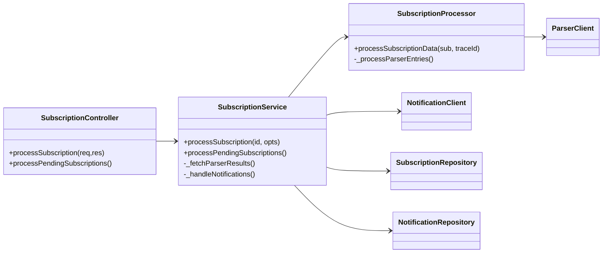
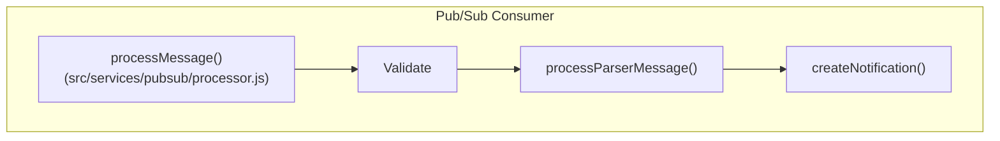

# Subscription Processing Workflow

> **Version**: auto-generated from repository source code – keep in sync with codebase changes.

---

## 1. High-level Overview

When a user (or a scheduled batch) requests the processing of a subscription, control flows through three independent Cloud Run services:

1. **subscription-worker** – Orchestrator. Exposes HTTP API, looks up subscription metadata, enriches prompts and calls the appropriate parser.
2. ***_parser** (e.g. **boe-parser**, **doga-parser**, **eu-parser**) – Heavy-weight content analysis service. Fetches official gazette data, performs AI matching and immediately publishes structured results to Pub/Sub.
3. **notification-worker** – Consumer. Listens to the Pub/Sub topic, validates every message, persists notifications to Postgres and (optionally) re-publishes downstream events.

```mermaid
sequenceDiagram
    autonumber
    participant U as User / Cron
    participant SW as subscription-worker (API)
    participant P as Parser Service (e.g. boe-parser)
    participant PS as Google Pub/Sub ‹subscription-notifications›
    participant NW as notification-worker
    participant DB as Postgres

    U->>+SW: HTTP POST /api/subscriptions/process/:id
    SW->>+DB: SELECT subscription, prompts, type
    SW->>+P: POST /api/analyze-text  (ParserRequest)
    P-->>-SW: 200 OK (ParserResponse)
    P-->>+PS: Publish <BoeParserResultMessage>
    SW-->>-DB: UPDATE subscription_processing, (optional) notification rows
    SW-->>-U: JSON status
    PS-->>+NW: delivers message
    NW->>+DB: INSERT notifications
    NW-->>-DB: ACK
    NW-->>-PS: ack()
```

---

## 2. Detailed Component Breakdown

### 2.1 subscription-worker

Key entry point: `src/index.js` (`express` server).



Processing algorithm (see `SubscriptionService.processSubscription`):

1. Fetch subscription row with `subscriptionRepository.findById()`.
2. Reject if `parser_url` missing ⇒ `status:"skipped"`.
3. Build request via `SubscriptionProcessor` → `ParserClient.send()`.
4. Receive normalised `entries[]` (matches).
5. Persist each match using `notificationRepository.createNotification()` **and** (if Pub/Sub is configured) publish lite message via `NotificationClient.publish()`.
6. Update bookkeeping table `subscription_processing` to `completed`.

`SubscriptionProcessor` adds user-profile context, validates prompts, and normalises parser output to a concise `matches[]` structure.

#### Request Format produced by subscription-worker
Reference: `src/utils/parser-protocol.js :: ParserRequestSchema`

```jsonc
{
  "texts": ["string", "…"],   // ≥1 prompt
  "user_id": "<UUID>",
  "subscription_id": "<UUID>",
  "date": "YYYY-MM-DD",        // default: today
  "service": "gemini" | "openai",
  "metadata": {
    "source": "subscription-worker"
  },
  "limit": 5                    // optional
}
```

### 2.2 Parser services (example: boe-parser)

Entry: `boe-parser/src/index.js` → Express route `/api/analyze-text` implemented in `routes/analyze.js`.
Core pipeline (simplified):

1. Validate & authenticate request (middleware).
2. `controllers/analyze.analyzeText()`
   1. `parseBOE()` → fetches BOE XML and extracts `items[]`.
   2. `analyzeBOEItems()` – AI scoring for every prompt.
3. Assemble `results` payload.
4. Asynchronously `publishResults()` to Pub/Sub topic `config.services.pubsub.topicId`.
5. Respond synchronously to caller with same JSON (used by subscription-worker for immediate feedback).

#### Pub/Sub message schema
Defined in `utils/schemas/pubsubMessages.js` and imported by notification-worker for validation.

```ts
interface BoeParserResultMessage {
  trace_id: string;
  processor_type?: 'boe' | string;   // added by publishResults()
  request: {
    subscription_id: string; // non-empty
    user_id: string;         // non-empty
    texts: string[];
  };
  results: {
    boe_info: {
      publication_date: string; // YYYY-MM-DD
      source_url: string;
    };
    query_date: string;
    results: Array<{
      prompt: string;
      matches: Match[];
    }>;
  };
  metadata: {
    processing_time_ms: number;
    total_items_processed: number;
    status: 'success' | 'error';
  };
}
```

`Match` uses the normalised shape created by `transformMatches()` (_document_type_, _title_, _summary_, _links_, _relevance_score_, …).

### 2.3 notification-worker

Runs an HTTP server for health checks but its main job lives in `src/services/pubsub/processor.js`.



Processing steps (see `services/parser.js`):

1. **Validate & normalise** incoming JSON with shared schema (`validateBoeParserMessage`) and a Zod model (`MessageSchema`).
2. For every `match` create a DB row via `createNotification()` (file `services/notification.js`).
3. Metric counters are updated and message `ack()` is called.
4. In case of fatal errors the original payload is published to the Dead-Letter Topic (`publishToDLQ`).

---

## 3. Deployment & Configuration

| Service | Cloud Run Image | Secrets / Runtime Vars |
|---------|-----------------|------------------------|
| subscription-worker | `gcr.io/.../subscription-worker` | `PARSER_API_KEY`, `DATABASE_URL`, `NOTIFICATION_TOPIC`, etc. |
| boe-parser (and other parsers) | `gcr.io/.../boe-parser` | `GEMINI_API_KEY`, `PUBSUB_TOPIC_ID`, etc. |
| notification-worker | `gcr.io/.../notification-worker` | `DATABASE_URL`, `PUBSUB_SUBSCRIPTION` |

All secrets are injected via Secret Manager or Cloud Run Runtime Vars – never through `.env` files.

---

## 4. Appendix – Source Schemas

### 4.1 Request & Response Zod definitions (excerpt)
`subscription-worker/src/utils/parser-protocol.js`
```js
const ParserRequestSchema = z.object({
  texts: z.array(z.string()).min(1),
  subscription_id: z.string().optional(),
  user_id: z.string().optional(),
  date: z.string().optional(),
  service: z.enum(['gemini', 'openai']).optional().default('gemini'),
  metadata: z.object({
    user_id: z.string().optional(),
    subscription_id: z.string().optional(),
    source: z.string().optional()
  }).optional(),
  limit: z.number().optional().default(5)
});
```

### 4.2 Pub/Sub message validator
`boe-parser/src/utils/schemas/pubsubMessages.js`
```js
export function validateBoeParserMessage(message) {
  if (!message) throw new Error('Message cannot be null');
  if (!message.trace_id) throw new Error('trace_id missing');
  // …see file for exhaustive checks
}
```

---

## 5. Future Parsers

The current architecture supports plug-and-play addition of new parsers. To introduce a new bulletin parser:
1. Implement `/api/analyze-text` with the same request/response contract.
2. Publish results to the common Pub/Sub topic.
3. Add a `subscription_types` row with the parser's Cloud Run URL.

_No changes are required in subscription-worker or notification-worker._

---

### End of Document 