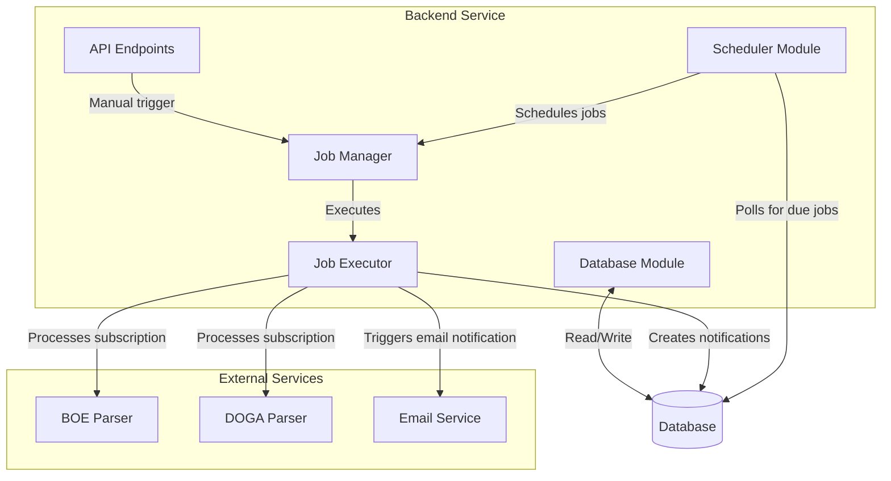

# Backend Scheduler Module Design

## Overview

The Backend Scheduler Module will be responsible for managing and executing scheduled jobs within the NIFYA platform, specifically focusing on subscription processing and notification generation.



## Core Components

### 1. Job Registry

Maintains a registry of all job types and their handlers:

```javascript
// src/scheduler/registry.js
const jobHandlers = {
  'process-subscription': async (jobData) => {
    // Implementation for processing a subscription
    const { subscriptionId, userId } = jobData;
    // ... process subscription logic
  },
  'send-digest-emails': async (jobData) => {
    // Implementation for triggering email digests
    const { hourOfDay } = jobData;
    // ... email digest logic
  }
};

export const getJobHandler = (jobType) => {
  return jobHandlers[jobType] || null;
};
```

### 2. Scheduler Service

Responsible for checking the database for due jobs and scheduling them:

```javascript
// src/scheduler/service.js
import { getJobHandler } from './registry.js';
import { getJobsReadyToRun, markJobAsProcessing, markJobAsComplete, markJobAsFailed } from '../database/jobs.js';

export class SchedulerService {
  constructor(options = {}) {
    this.pollInterval = options.pollInterval || 60000; // 1 minute
    this.isRunning = false;
    this.timer = null;
  }
  
  async start() {
    if (this.isRunning) return;
    
    this.isRunning = true;
    this.poll();
    
    console.log('Scheduler service started');
  }
  
  async stop() {
    if (!this.isRunning) return;
    
    this.isRunning = false;
    if (this.timer) {
      clearTimeout(this.timer);
      this.timer = null;
    }
    
    console.log('Scheduler service stopped');
  }
  
  async poll() {
    if (!this.isRunning) return;
    
    try {
      await this.processDueJobs();
    } catch (error) {
      console.error('Error processing due jobs:', error);
    }
    
    // Schedule next poll
    this.timer = setTimeout(() => this.poll(), this.pollInterval);
  }
  
  async processDueJobs() {
    // Get all jobs ready to run
    const dueJobs = await getJobsReadyToRun();
    
    for (const job of dueJobs) {
      this.processJob(job).catch(console.error);
    }
  }
  
  async processJob(job) {
    // Mark job as being processed
    await markJobAsProcessing(job.id);
    
    try {
      // Get the handler for this job type
      const handler = getJobHandler(job.type);
      
      if (!handler) {
        throw new Error(`No handler registered for job type: ${job.type}`);
      }
      
      // Execute the job
      await handler(job.data);
      
      // Mark job as completed
      await markJobAsComplete(job.id);
      
      // If recurring, schedule the next execution
      if (job.schedule) {
        await this.scheduleNextExecution(job);
      }
    } catch (error) {
      // Mark job as failed
      await markJobAsFailed(job.id, error.message);
    }
  }
  
  async scheduleNextExecution(job) {
    // Calculate next execution time based on the schedule
    const nextRunTime = calculateNextRunTime(job.schedule);
    
    // Create a new job instance for the next execution
    await createScheduledJob({
      type: job.type,
      data: job.data,
      schedule: job.schedule,
      nextRunAt: nextRunTime
    });
  }
}
```

### 3. Database Schema for Jobs

```sql
CREATE TABLE IF NOT EXISTS scheduled_jobs (
  id UUID PRIMARY KEY DEFAULT gen_random_uuid(),
  type VARCHAR(255) NOT NULL,
  data JSONB NOT NULL DEFAULT '{}',
  status VARCHAR(50) NOT NULL DEFAULT 'pending',
  schedule JSONB,
  next_run_at TIMESTAMP WITH TIME ZONE NOT NULL,
  last_run_at TIMESTAMP WITH TIME ZONE,
  created_at TIMESTAMP WITH TIME ZONE DEFAULT NOW(),
  updated_at TIMESTAMP WITH TIME ZONE DEFAULT NOW(),
  created_by VARCHAR(128) REFERENCES users(id),
  error TEXT
);

CREATE INDEX IF NOT EXISTS idx_scheduled_jobs_status ON scheduled_jobs(status);
CREATE INDEX IF NOT EXISTS idx_scheduled_jobs_next_run_at ON scheduled_jobs(next_run_at);
```

### 4. Job Types

#### Subscription Processing Job

```json
{
  "type": "process-subscription",
  "data": {
    "subscriptionId": "subscription-uuid",
    "userId": "user-id"
  },
  "schedule": {
    "type": "cron",
    "expression": "0 9 * * *",
    "timezone": "Europe/Madrid"
  },
  "next_run_at": "2023-09-01T09:00:00Z"
}
```

#### Email Digest Job

```json
{
  "type": "send-digest-emails",
  "data": {
    "hourOfDay": "09"
  },
  "schedule": {
    "type": "cron",
    "expression": "0 9 * * *",
    "timezone": "UTC"
  },
  "next_run_at": "2023-09-01T09:00:00Z"
}
```

## Implementation Plan

### 1. Database Setup

1. Create the `scheduled_jobs` table in the database
2. Create indexes for optimal query performance
3. Add utility functions to query and update jobs

### 2. Core Scheduler Module

1. Implement the `SchedulerService` class to poll for due jobs
2. Create job handler registry for different job types
3. Implement scheduling and execution logic

### 3. Job Types Implementation

1. Implement handler for subscription processing jobs
2. Implement handler for email digest jobs
3. Add extensible mechanism to add new job types

### 4. Integration with Backend

1. Initialize the scheduler when the backend starts
2. Expose API endpoints to manage jobs manually
3. Hook into existing subscription and notification systems

### 5. Monitoring and Management

1. Add logging for job execution
2. Implement retry mechanisms for failed jobs
3. Create admin dashboard for job monitoring

## API Endpoints

Add these endpoints to the backend API:

```javascript
// GET /api/admin/jobs - List all scheduled jobs
// POST /api/admin/jobs - Create a new scheduled job
// GET /api/admin/jobs/:id - Get details of a specific job
// PUT /api/admin/jobs/:id - Update a job
// DELETE /api/admin/jobs/:id - Delete a job
// POST /api/admin/jobs/:id/run - Manually trigger a job
```

## Subscription Processing Implementation

The key implementation for subscription processing:

```javascript
async function processSubscription(subscriptionId, userId) {
  try {
    // 1. Get subscription details
    const subscription = await getSubscriptionById(subscriptionId);
    
    if (!subscription || !subscription.active) {
      throw new Error(`Subscription ${subscriptionId} not found or inactive`);
    }
    
    // 2. Determine which parser to use based on subscription type
    const parser = getParserForSubscriptionType(subscription.type_id);
    
    // 3. Fetch new content since last run
    const lastRunTime = await getLastRunTimeForSubscription(subscriptionId);
    const newContent = await parser.fetchNewContent(subscription.prompts, lastRunTime);
    
    // 4. Process the content and generate notifications
    for (const content of newContent) {
      await createNotification({
        userId,
        subscriptionId,
        title: content.title,
        content: content.summary,
        sourceUrl: content.url,
        metadata: content.metadata
      });
    }
    
    // 5. Update the subscription processing status
    await updateSubscriptionProcessingStatus(subscriptionId, {
      lastRunAt: new Date(),
      status: 'completed'
    });
    
    return {
      success: true,
      newNotifications: newContent.length
    };
  } catch (error) {
    // Log and handle error
    await updateSubscriptionProcessingStatus(subscriptionId, {
      lastRunAt: new Date(),
      status: 'failed',
      error: error.message
    });
    
    throw error;
  }
}
```

## Schedule Calculation

To handle various schedule types (daily, weekly, etc.):

```javascript
function calculateNextRunTime(schedule) {
  if (schedule.type === 'cron') {
    // Use a cron parser library to calculate next run time
    return calculateNextCronTime(schedule.expression, schedule.timezone);
  }
  
  if (schedule.type === 'interval') {
    // Calculate based on interval (e.g., every 12 hours)
    const now = new Date();
    return new Date(now.getTime() + schedule.intervalMs);
  }
  
  if (schedule.type === 'daily') {
    // Run at specific time each day
    return calculateNextDailyTime(schedule.hourOfDay, schedule.minuteOfHour, schedule.timezone);
  }
  
  if (schedule.type === 'weekly') {
    // Run on specific days of the week
    return calculateNextWeeklyTime(schedule.daysOfWeek, schedule.hourOfDay, schedule.minuteOfHour, schedule.timezone);
  }
  
  throw new Error(`Unsupported schedule type: ${schedule.type}`);
}
```

## Initialization in Backend

Add this to the backend startup code:

```javascript
// src/index.js or src/server.js
import { SchedulerService } from './scheduler/service.js';

async function startServer() {
  // Initialize other services...
  
  // Initialize and start the scheduler
  const scheduler = new SchedulerService({
    pollInterval: process.env.SCHEDULER_POLL_INTERVAL || 60000
  });
  
  await scheduler.start();
  
  // Add a graceful shutdown handler
  process.on('SIGTERM', async () => {
    console.log('Shutting down scheduler...');
    await scheduler.stop();
    // Other shutdown logic...
  });
}

startServer().catch(console.error);
```

## Monitoring and Handling Failures

1. Implement job retry logic with exponential backoff
2. Set up alerts for repeatedly failing jobs
3. Create a dashboard to monitor job executions
4. Implement circuit breaker for external dependencies

## Conclusion

This backend scheduler module provides a robust solution for running subscription processing and other recurring tasks without requiring a separate microservice. It leverages the existing database and can be expanded to handle different job types as needed.

The design prioritizes:
- Reliability through proper error handling and retries
- Flexibility with various schedule types
- Extensibility to add new job types
- Observability via logging and monitoring

By integrating directly with the backend, it avoids the operational overhead of maintaining another service while still providing a clean separation of concerns through modular code organization. 