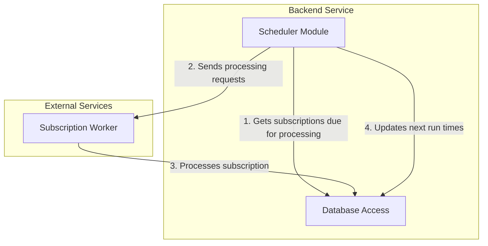

# Backend Scheduler Module - MVP Implementation

## Overview

This document outlines the minimal viable product (MVP) implementation for the Backend Scheduler Module. The core functionality is to run a daily job that processes all user subscriptions that need updates.



## MVP Requirements

For the initial implementation, we will focus only on:

1. A simple in-memory scheduler that runs once per day
2. Ability to scan the database for subscriptions that need processing
3. Triggering the existing subscription worker to process each subscription
4. Updating the subscription status after processing

## Database Utilization

We will use the existing subscription_processing table:

```sql
-- Existing table, no changes needed
CREATE TABLE IF NOT EXISTS subscription_processing (
  id UUID PRIMARY KEY DEFAULT gen_random_uuid(),
  subscription_id UUID NOT NULL REFERENCES subscriptions(id) ON DELETE CASCADE,
  status VARCHAR(50) NOT NULL DEFAULT 'pending',
  next_run_at TIMESTAMP WITH TIME ZONE,
  last_run_at TIMESTAMP WITH TIME ZONE,
  error TEXT,
  metadata JSONB DEFAULT '{}',
  created_at TIMESTAMP WITH TIME ZONE DEFAULT NOW(),
  updated_at TIMESTAMP WITH TIME ZONE DEFAULT NOW()
);
```

## Implementation

### 1. Scheduler Module Structure

```
backend/
└── src/
    └── scheduler/
        ├── index.js         # Module entry point
        ├── scheduler.js     # Core scheduler implementation
        ├── processors.js    # Job processing logic
        └── database.js      # Database interactions
```

### 2. Core Scheduler Implementation

```javascript
// src/scheduler/scheduler.js
import { processSubscriptionBatch } from './processors.js';
import logger from '../utils/logger.js';

export class SimpleScheduler {
  constructor() {
    this.isRunning = false;
    this.dailyJob = null;
  }
  
  start() {
    if (this.isRunning) return;
    
    this.isRunning = true;
    this.scheduleDailyJob();
    
    logger.info('Scheduler started');
  }
  
  stop() {
    if (!this.isRunning) return;
    
    this.isRunning = false;
    if (this.dailyJob) {
      clearTimeout(this.dailyJob);
      this.dailyJob = null;
    }
    
    logger.info('Scheduler stopped');
  }
  
  scheduleDailyJob() {
    // Calculate time until next run (9 AM)
    const now = new Date();
    const nextRun = new Date(now);
    nextRun.setHours(9, 0, 0, 0);
    
    if (nextRun <= now) {
      // If 9 AM today has passed, schedule for tomorrow
      nextRun.setDate(nextRun.getDate() + 1);
    }
    
    const msUntilNextRun = nextRun.getTime() - now.getTime();
    
    logger.info(`Scheduling daily job to run in ${Math.floor(msUntilNextRun / 1000 / 60)} minutes`);
    
    this.dailyJob = setTimeout(async () => {
      if (!this.isRunning) return;
      
      try {
        logger.info('Running daily subscription processing');
        await processSubscriptionBatch();
      } catch (error) {
        logger.error('Error in daily job', { error: error.message });
      } finally {
        // Schedule next run
        this.scheduleDailyJob();
      }
    }, msUntilNextRun);
  }
  
  // For testing or manual triggering
  async runNow() {
    logger.info('Manually running subscription processing');
    return processSubscriptionBatch();
  }
}
```

### 3. Subscription Processing

```javascript
// src/scheduler/processors.js
import { getSubscriptionsDueForProcessing, updateSubscriptionProcessingStatus } from './database.js';
import { sendProcessRequest } from '../services/subscriptionWorker.js';
import logger from '../utils/logger.js';

export async function processSubscriptionBatch(options = {}) {
  const { batchSize = 100, parallel = 5 } = options;
  
  try {
    // Get subscriptions due for processing
    const subscriptions = await getSubscriptionsDueForProcessing(batchSize);
    
    logger.info(`Found ${subscriptions.length} subscriptions due for processing`);
    
    if (subscriptions.length === 0) {
      return { processed: 0 };
    }
    
    // Process in smaller parallel batches to avoid overwhelming the system
    const results = [];
    for (let i = 0; i < subscriptions.length; i += parallel) {
      const batch = subscriptions.slice(i, i + parallel);
      
      const promises = batch.map(async (subscription) => {
        try {
          // Mark as processing
          await updateSubscriptionProcessingStatus(subscription.id, {
            status: 'processing',
            updatedAt: new Date()
          });
          
          // Send to subscription worker
          await sendProcessRequest(subscription.subscription_id, subscription.user_id);
          
          // Mark as completed
          await updateSubscriptionProcessingStatus(subscription.id, {
            status: 'completed',
            lastRunAt: new Date(),
            nextRunAt: calculateNextRunTime(subscription.frequency)
          });
          
          return { success: true, subscriptionId: subscription.subscription_id };
        } catch (error) {
          // Mark as failed
          await updateSubscriptionProcessingStatus(subscription.id, {
            status: 'failed',
            error: error.message,
            updatedAt: new Date()
          });
          
          logger.error(`Failed to process subscription ${subscription.subscription_id}`, {
            error: error.message
          });
          
          return { success: false, subscriptionId: subscription.subscription_id, error: error.message };
        }
      });
      
      const batchResults = await Promise.all(promises);
      results.push(...batchResults);
    }
    
    const successful = results.filter(r => r.success).length;
    const failed = results.length - successful;
    
    logger.info(`Processed ${results.length} subscriptions: ${successful} successful, ${failed} failed`);
    
    return {
      processed: results.length,
      successful,
      failed
    };
  } catch (error) {
    logger.error('Error processing subscription batch', {
      error: error.message,
      stack: error.stack
    });
    
    throw error;
  }
}

function calculateNextRunTime(frequency) {
  const now = new Date();
  
  switch (frequency) {
    case 'daily':
      const tomorrow = new Date(now);
      tomorrow.setDate(tomorrow.getDate() + 1);
      tomorrow.setHours(9, 0, 0, 0);
      return tomorrow;
      
    case 'weekly':
      const nextWeek = new Date(now);
      nextWeek.setDate(nextWeek.getDate() + 7);
      nextWeek.setHours(9, 0, 0, 0);
      return nextWeek;
      
    case 'monthly':
      const nextMonth = new Date(now);
      nextMonth.setMonth(nextMonth.getMonth() + 1);
      nextMonth.setHours(9, 0, 0, 0);
      return nextMonth;
      
    default:
      // Default to daily
      const defaultNext = new Date(now);
      defaultNext.setDate(defaultNext.getDate() + 1);
      defaultNext.setHours(9, 0, 0, 0);
      return defaultNext;
  }
}
```

### 4. Database Access

```javascript
// src/scheduler/database.js
import { pool } from '../database/connection.js';
import logger from '../utils/logger.js';

export async function getSubscriptionsDueForProcessing(limit = 100) {
  try {
    const query = `
      SELECT 
        sp.id,
        sp.subscription_id,
        s.user_id,
        s.frequency
      FROM subscription_processing sp
      JOIN subscriptions s ON s.id = sp.subscription_id
      WHERE 
        s.active = true
        AND (
          sp.next_run_at IS NULL 
          OR sp.next_run_at <= NOW()
        )
        AND (
          sp.status = 'pending'
          OR sp.status = 'failed'
          OR (sp.status = 'completed' AND sp.next_run_at <= NOW())
        )
      ORDER BY sp.next_run_at ASC NULLS FIRST
      LIMIT $1
    `;
    
    const result = await pool.query(query, [limit]);
    return result.rows;
  } catch (error) {
    logger.error('Error getting subscriptions due for processing', {
      error: error.message,
      stack: error.stack
    });
    throw error;
  }
}

export async function updateSubscriptionProcessingStatus(processingId, updates) {
  try {
    const setFields = [];
    const values = [];
    let valueIndex = 1;
    
    Object.entries(updates).forEach(([key, value]) => {
      setFields.push(`${key} = $${valueIndex}`);
      values.push(value);
      valueIndex++;
    });
    
    // Always update the updated_at field
    setFields.push(`updated_at = NOW()`);
    
    const query = `
      UPDATE subscription_processing
      SET ${setFields.join(', ')}
      WHERE id = $${valueIndex}
      RETURNING *
    `;
    
    values.push(processingId);
    
    const result = await pool.query(query, values);
    return result.rows[0];
  } catch (error) {
    logger.error('Error updating subscription processing status', {
      error: error.message,
      processingId,
      stack: error.stack
    });
    throw error;
  }
}
```

### 5. Module Integration

```javascript
// src/scheduler/index.js
import { SimpleScheduler } from './scheduler.js';
import logger from '../utils/logger.js';

let scheduler = null;

export function initializeScheduler() {
  if (scheduler) {
    logger.warn('Scheduler already initialized');
    return scheduler;
  }
  
  scheduler = new SimpleScheduler();
  scheduler.start();
  
  logger.info('Scheduler initialized');
  
  return scheduler;
}

export function getScheduler() {
  if (!scheduler) {
    throw new Error('Scheduler not initialized');
  }
  
  return scheduler;
}

export function shutdownScheduler() {
  if (scheduler) {
    scheduler.stop();
    scheduler = null;
    logger.info('Scheduler shutdown complete');
  }
}

export async function triggerManualRun() {
  if (!scheduler) {
    throw new Error('Scheduler not initialized');
  }
  
  return scheduler.runNow();
}
```

### 6. Subscription Worker Client

```javascript
// src/services/subscriptionWorker.js
import axios from 'axios';
import logger from '../utils/logger.js';

const SUBSCRIPTION_WORKER_URL = process.env.SUBSCRIPTION_WORKER_URL || 'https://subscription-worker-415554190254.us-central1.run.app';

export async function sendProcessRequest(subscriptionId, userId) {
  try {
    const url = `${SUBSCRIPTION_WORKER_URL}/process`;
    
    logger.info(`Sending process request to subscription worker for subscription ${subscriptionId}`);
    
    const response = await axios.post(url, {
      subscriptionId,
      userId
    });
    
    logger.info(`Successfully processed subscription ${subscriptionId}`, {
      status: response.status
    });
    
    return response.data;
  } catch (error) {
    logger.error(`Error processing subscription ${subscriptionId}`, {
      error: error.message,
      status: error.response?.status,
      data: error.response?.data
    });
    
    throw error;
  }
}
```

### 7. API Endpoint for Manual Triggering

```javascript
// Add to src/api/admin/routes.js
import { triggerManualRun } from '../../scheduler/index.js';

router.post('/admin/process-subscriptions', async (req, res) => {
  try {
    const result = await triggerManualRun();
    res.json({ 
      success: true, 
      message: 'Subscription processing triggered', 
      result 
    });
  } catch (error) {
    res.status(500).json({ 
      success: false, 
      message: 'Failed to trigger subscription processing',
      error: error.message
    });
  }
});
```

### 8. Main Server Integration

```javascript
// Update src/server.js
import { initializeScheduler, shutdownScheduler } from './scheduler/index.js';

// After initializing everything else
initializeScheduler();

// In shutdown handler
process.on('SIGTERM', async () => {
  await shutdownScheduler();
  // Other shutdown logic
});
```

## Testing

For MVP testing, manually trigger the job through the API endpoint:

```
POST /api/admin/process-subscriptions
```

## Deployment Steps

1. Add the scheduler module to the backend codebase
2. Ensure the subscription worker's `/process` endpoint is accessible
3. Deploy the updated backend
4. Test by manually triggering subscription processing
5. Monitor logs to verify proper functioning

## Next Steps After MVP

Once the MVP is working, consider these enhancements:

1. Switch to a more robust scheduling mechanism
2. Add support for different timezones
3. Implement retries with exponential backoff
4. Add dashboard for monitoring job execution
5. Add more granular control over subscription processing 