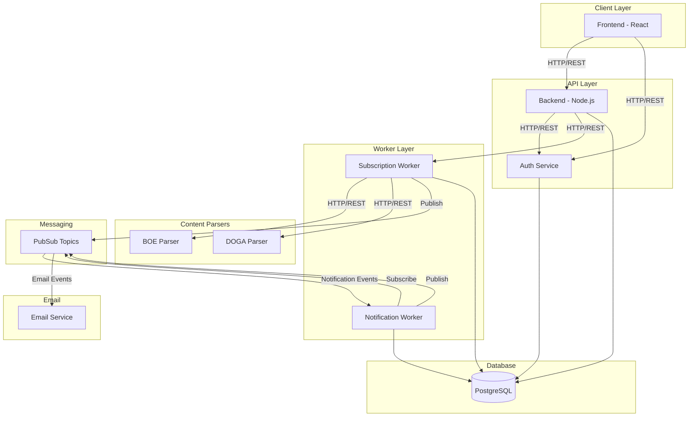
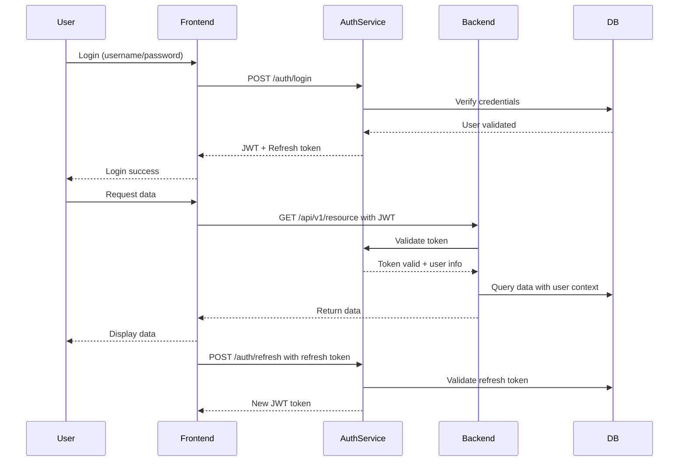
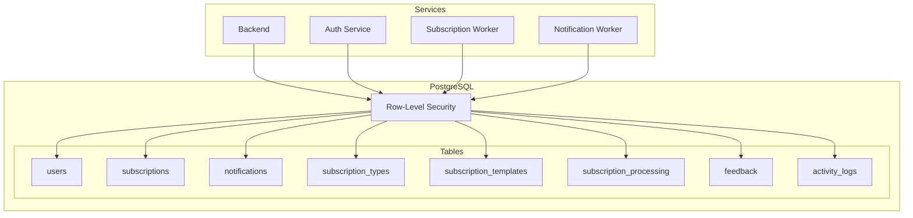
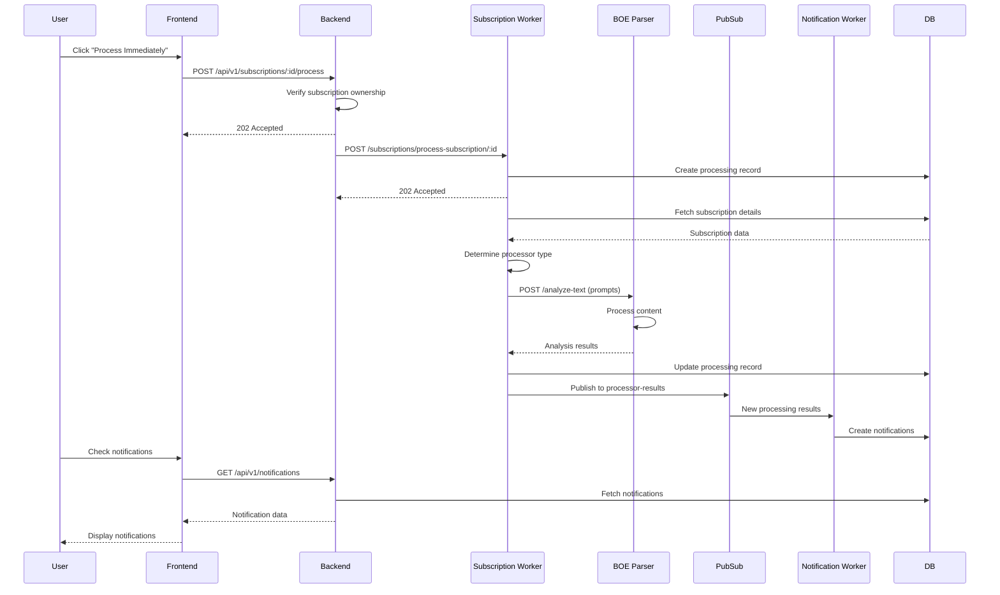
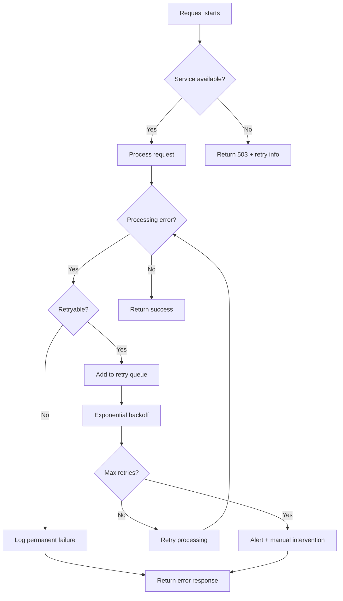
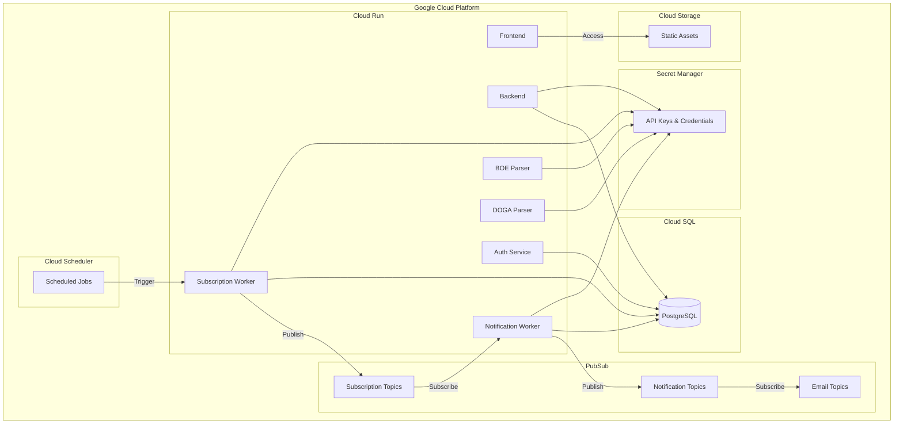

# NIFYA System Architecture

This document provides a comprehensive overview of the NIFYA platform architecture, detailing how all services communicate and interact with each other.

## System Overview

NIFYA is built with a microservices architecture where specialized services handle specific domains of functionality. The diagram below shows the high-level architecture and communication patterns between services:



## Service Details

### Frontend (React)
- **URL**: https://nifya.app
- **Purpose**: Provides the user interface for interacting with the platform
- **Communication**:
  - Communicates with Backend via REST APIs
  - Communicates with Auth Service for authentication

### Backend (Node.js/Fastify)
- **URL**: https://backend-415554190254.us-central1.run.app
- **Purpose**: Core orchestration service for subscriptions and notifications
- **Communication**:
  - Receives requests from Frontend
  - Forwards subscription processing requests to Subscription Worker
  - Queries database for subscription and notification data
  - Validates user authentication via Auth Service

### Authentication Service
- **URL**: https://authentication-415554190254.us-central1.run.app
- **Purpose**: Handles user identity, authentication, and security
- **Communication**:
  - Provides authentication endpoints for login/register
  - Issues JWT tokens for authenticated users
  - Validates tokens for other services

### Subscription Worker
- **URL**: https://subscription-worker-415554190254.us-central1.run.app
- **Purpose**: Processes subscription requests and coordinates with content parsers
- **Communication**:
  - Receives processing requests from Backend
  - Sends analysis requests to content parsers (BOE/DOGA)
  - Publishes results to PubSub topics
  - Stores processing records in database

### Notification Worker
- **URL**: https://notification-worker-415554190254.us-central1.run.app
- **Purpose**: Processes notification messages and stores them in the database
- **Communication**:
  - Subscribes to PubSub notification topics
  - Creates notification records in database
  - Publishes email events to PubSub

### BOE Parser
- **URL**: https://boe-parser-415554190254.us-central1.run.app
- **Purpose**: AI-powered analysis of Spanish Official Bulletin (BOE)
- **Communication**:
  - Receives analysis requests from Subscription Worker
  - Returns analysis results with matching documents

### DOGA Parser
- **URL**: https://doga-parser-415554190254.us-central1.run.app
- **Purpose**: AI-powered analysis of Galician Official Bulletin (DOGA)
- **Communication**:
  - Receives analysis requests from Subscription Worker
  - Returns analysis results with matching documents

### Email Service
- **Purpose**: Sends email summaries of notifications to users
- **Communication**:
  - Subscribes to email notification PubSub topic
  - Sends emails to users

## Communication Protocols

### HTTP/REST Endpoints

#### Frontend → Authentication Service
- **Protocol**: HTTP/REST
- **Authentication**: JWT
- **Key Endpoints**:
  - `POST /auth/login`: User authentication
  - `POST /auth/register`: User registration
  - `POST /auth/refresh`: Token refresh
  - `GET /auth/me`: Current user info

#### Frontend → Backend
- **Protocol**: HTTP/REST
- **Authentication**: JWT in `Authorization` header + `X-User-ID` header
- **Key Endpoints**:
  - `GET /api/v1/subscriptions`: List user subscriptions
  - `POST /api/v1/subscriptions`: Create subscription
  - `GET /api/v1/subscriptions/:id`: Get subscription details
  - `PATCH /api/v1/subscriptions/:id`: Update subscription
  - `DELETE /api/v1/subscriptions/:id`: Delete subscription
  - `POST /api/v1/subscriptions/:id/process`: Process subscription immediately
  - `GET /api/v1/notifications`: Get user notifications
  - `GET /api/v1/subscription-types`: Get subscription types

#### Backend → Subscription Worker
- **Protocol**: HTTP/REST
- **Authentication**: API Key (optional)
- **Key Endpoints**:
  - `POST /subscriptions/process-subscription/:id`: Process specific subscription
  - `GET /healthz`: Health check endpoint

#### Subscription Worker → Content Parsers (BOE/DOGA)
- **Protocol**: HTTP/REST
- **Authentication**: API Key in `Authorization` header
- **Request Format**: JSON with prompts and metadata
- **Key Endpoints**:
  - `POST /analyze-text`: Submit queries for content analysis
  - `GET /health`: Health check endpoint

### PubSub Messaging

#### Subscription Worker → Notification Worker
- **Topic**: `processor-results`
- **Protocol**: PubSub
- **Message Format**:
  ```json
  {
    "version": "1.0",
    "processor_type": "boe|doga|real_estate",
    "timestamp": "ISO8601 timestamp",
    "request": {
      "subscription_id": "uuid",
      "processing_id": "uuid",
      "user_id": "uuid",
      "prompts": ["search prompt 1", "search prompt 2"]
    },
    "results": {
      "query_date": "2025-02-11",
      "matches": [
        {
          "prompt": "search prompt 1",
          "documents": [
            {
              "document_type": "boe_document",
              "title": "Document Title",
              "summary": "Document Summary",
              "relevance_score": 0.95,
              "links": {
                "html": "https://example.com/doc.html",
                "pdf": "https://example.com/doc.pdf"
              }
            }
          ]
        }
      ]
    }
  }
  ```

#### Backend → Subscription Worker
- **Topic**: `subscription-created` / `subscription-updated`
- **Protocol**: PubSub
- **Message Format**:
  ```json
  {
    "event": "subscription_created|subscription_updated",
    "subscription_id": "uuid",
    "user_id": "uuid",
    "timestamp": "ISO8601 timestamp",
    "data": {
      "type": "boe|doga|real_estate",
      "prompts": ["prompt1", "prompt2"],
      "frequency": "immediate|daily"
    }
  }
  ```

#### Notification Worker → Email Service
- **Topic**: `email-notifications`
- **Protocol**: PubSub
- **Message Format**:
  ```json
  {
    "event": "notification_created",
    "user_id": "uuid",
    "timestamp": "ISO8601 timestamp",
    "notification_data": {
      "id": "uuid",
      "title": "Notification Title",
      "content": "Notification Content",
      "subscription_id": "uuid",
      "source_url": "https://example.com/source"
    }
  }
  ```

## Authentication Flows



## Database Access Patterns

The system uses a shared PostgreSQL database with Row-Level Security (RLS) for data isolation.



### Key Database Tables

1. **users**: Core user data 
   - ID, email, password hash, created_at, updated_at

2. **subscriptions**: User subscriptions with prompts and frequency
   - ID, user_id, type_id, name, prompts, frequency, active, created_at, updated_at

3. **notifications**: Messages generated for users based on subscriptions
   - ID, user_id, subscription_id, title, content, read, created_at, updated_at

4. **subscription_types**: Types of available subscriptions
   - ID, name, slug, description, created_at, updated_at

5. **subscription_processing**: Records of subscription processing
   - ID, subscription_id, status, result, created_at, updated_at

## Subscription Processing Flow



## Error Handling Patterns



## Deployment Architecture

The system is deployed on Google Cloud Run with the following high-level architecture:



## Maintaining This Document

This architecture document should be updated when:

1. New services are added
2. Communication patterns change
3. API endpoints are modified
4. Database schema changes significantly
5. Authentication flows are updated

The system architecture should be reviewed quarterly to ensure it remains accurate and up-to-date. 