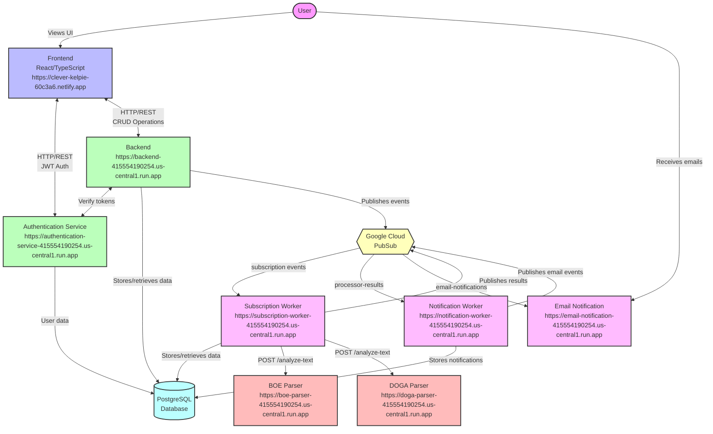

# NIFYA System Architecture - Modern Representation

Below is a modern diagram showing the relationships between all NIFYA microservices:

## System Layers

### Client Layer
- **Frontend**: React/TypeScript application that provides the user interface
  - Communicates with Backend for CRUD operations
  - Uses Authentication Service for user management

### API Layer
- **Backend**: Core REST API service that handles business logic
  - Orchestrates subscription management
  - Provides endpoints for the Frontend
  - Publishes events to PubSub for asynchronous processing

- **Authentication Service**: Handles user authentication and authorization
  - Issues and validates JWT tokens
  - Manages user account operations
  - Secures API access

### Processing Layer
- **Subscription Worker**: Processes subscription requests
  - Consumes events from PubSub topics
  - Uses content parsers to analyze official bulletins
  - Generates processing results for notifications

- **BOE Parser**: Specializes in Spanish Official Bulletin analysis
  - Provides AI-powered text analysis
  - Takes prompts and returns relevant documents

- **DOGA Parser**: Specializes in Galician Official Bulletin analysis
  - Similar functionality to BOE Parser, but for DOGA content
  - Takes prompts and returns relevant documents

### Notification Layer
- **Notification Worker**: Creates and manages notifications
  - Consumes processing results from PubSub
  - Stores notifications in the database
  - Triggers email notifications as needed

- **Email Notification**: Delivers email summaries to users
  - Consumes email events from PubSub
  - Formats and sends personalized emails
  - Tracks delivery status

### Data Layer
- **PostgreSQL Database**: Central data store
  - Stores user data, subscriptions, and notifications
  - Implements row-level security (RLS) for data isolation
  - Shared across services with appropriate access controls

### Messaging Layer
- **Google Cloud PubSub**: Asynchronous messaging service
  - Decouples services for better scalability
  - Manages message queues between components
  - Provides reliable message delivery

## Communication Protocols

1. **HTTP/REST**:
   - Frontend ↔ Backend
   - Frontend ↔ Authentication Service
   - Subscription Worker ↔ Content Parsers (BOE/DOGA)

2. **PubSub Messaging**:
   - Backend → Subscription Worker
   - Subscription Worker → Notification Worker
   - Notification Worker → Email Service

3. **Database Access**:
   - All services → PostgreSQL Database (with appropriate permissions)

## Deployment Information

All services are deployed on Google Cloud Run, providing:
- Automatic scaling
- High availability
- Containerized deployment
- Secure service-to-service communication 