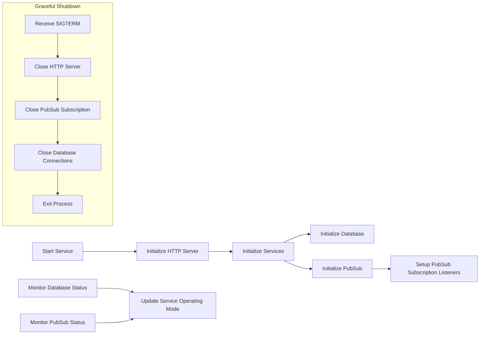
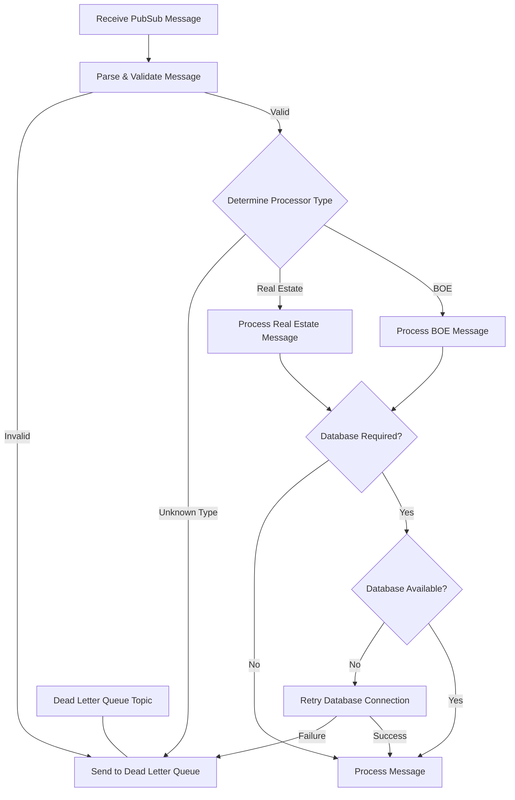
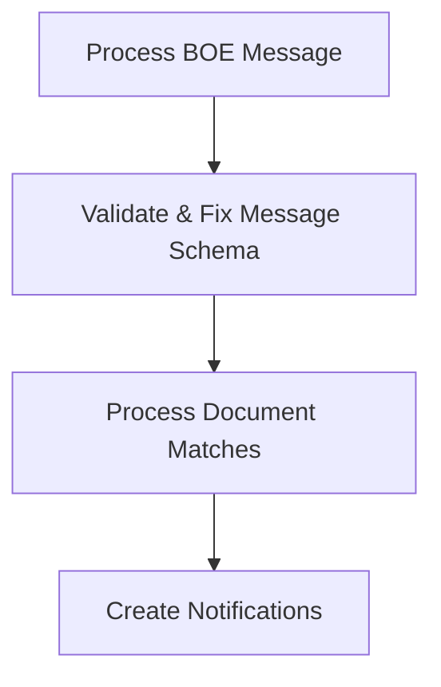
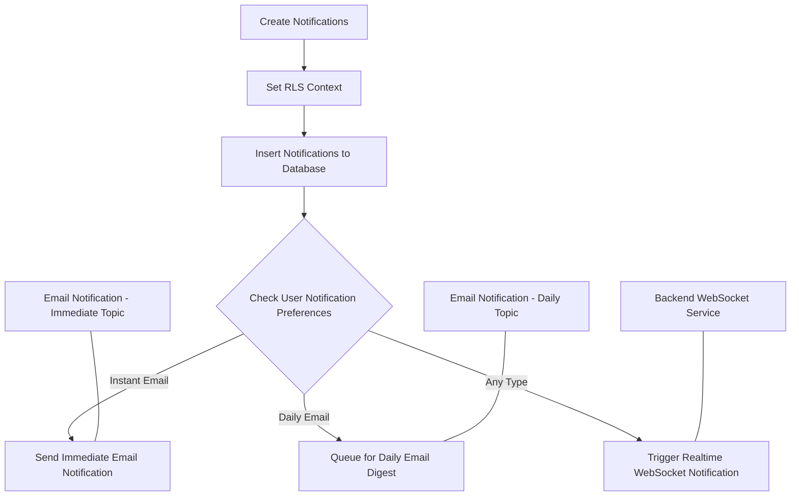
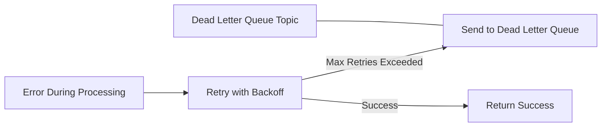

# Notification Worker Process Flow

This document outlines the process flow of the Notification Worker service, split into multiple diagrams for better readability.

## 1. Service Initialization

## 2. Message Processing Flow

## 3. BOE Document Processing

## 4. Notification Creation & Delivery

## 5. Error Handling & Recovery

## Notification Worker Process Description

The notification worker is a service that processes messages from PubSub, creates notifications based on the message content, and delivers them through various channels (database, WebSockets, emails).

### Key Components:

1. **Service Initialization**
   - Starts the HTTP server for health checks and API endpoints
   - Initializes the database connection
   - Sets up PubSub subscription to listen for messages
   - Configures error handling and recovery mechanisms

2. **Message Processing**
   - Receives messages from PubSub subscription
   - Validates and parses the message data
   - Routes the message to the appropriate processor based on type (BOE, Real Estate)
   - Handles invalid messages by sending them to a Dead Letter Queue (DLQ)

3. **Document Processing**
   - For BOE messages, validates and fixes the message schema
   - Processes document matches from the message
   - Extracts relevant information for notifications

4. **Notification Creation**
   - Sets Row-Level Security (RLS) context to bypass security policies
   - Creates notifications in the database
   - Enriches notification data with additional context

5. **Notification Delivery**
   - Checks user notification preferences
   - For users with instant notifications enabled, publishes to immediate email topic
   - For users with daily digest enabled, queues notifications for daily digest
   - Triggers realtime notifications via WebSocket to the backend service

6. **Error Handling**
   - Implements retry logic with exponential backoff for transient errors
   - Publishes failed messages to Dead Letter Queue for later analysis
   - Maintains service health metrics for monitoring

7. **Service Monitoring**
   - Tracks the status of database and PubSub connections
   - Updates service operating mode based on component health
   - Provides health check endpoints for Cloud Run

8. **Graceful Shutdown**
   - Handles SIGTERM signals for clean shutdown
   - Closes HTTP server to stop accepting new requests
   - Closes PubSub subscription and database connections
   - Exits the process cleanly

### Data Flow:
1. Messages arrive via PubSub subscription
2. Messages are validated and routed to appropriate processors
3. Processors extract notification data from messages
4. Notifications are stored in the database
5. Notifications are delivered through multiple channels:
   - Stored in database for UI display
   - Sent via WebSocket for realtime updates
   - Delivered via email (immediate or daily digest)

### Key Technologies:
- Node.js
- PostgreSQL
- Google PubSub
- Google Secret Manager
- WebSockets (for realtime notifications)
- HTTP/REST (for communication with other services) 