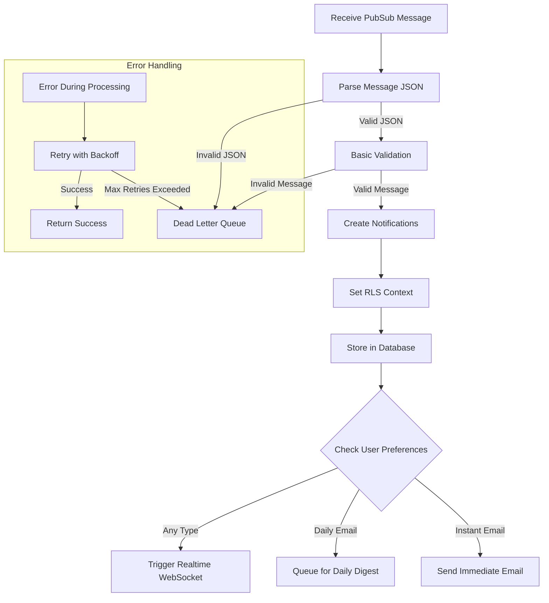

# Notification Worker Restructuring Plan

## Current Issues

After analyzing the notification worker service's code and architecture, several issues have been identified:

1. **Overly Complex Message Processing Flow**:
   - The service is determining processor types (BOE, Real Estate) when it should be processor-agnostic
   - Unnecessary complexity with processor type routing when all messages should follow the same format
   - Database connectivity checking logic adds unnecessary complexity

2. **Responsibility Confusion**:
   - The service is doing work that belongs to other services (subscription worker)
   - The notification worker should simply receive notification data and store it

3. **Error-Prone Architecture**:
   - Multiple conditional paths for database availability
   - Complex validation and message recovery logic

## Restructuring Goals

1. **Simplified Message Processing**: Create a streamlined flow focused solely on:
   - Receiving PubSub messages
   - Validating message data (minimal validation)
   - Storing notifications in the database
   - Triggering delivery mechanisms (WebSocket, email)

2. **Standardized Message Format**: Ensure all parsers use the same message format, eliminating the need for type-specific processing

3. **Improved Reliability**: Remove unnecessary complexity and failure points

## Current vs. Proposed Message Flow

### Current Flow:
```
Receive PubSub Message → Parse & Validate → Determine Processor Type → Check Database Required → Check Database Available → Process Based on Type → Create Notifications
```

### Proposed Flow:
```
Receive PubSub Message → Parse & Validate → Store Notification → Trigger Delivery Mechanisms
```

## Implementation Plan

### 1. Message Processing Refactoring

**File: `src/services/pubsub/processor.js`**

Replace the processor-specific routing with a single notification processor:

```javascript
// Remove the processor map
// const PROCESSOR_MAP = {
//   'boe': Object.assign(processBOEMessage, { requiresDatabase: true }),
//   'real-estate': Object.assign(processRealEstateMessage, { requiresDatabase: true }),
// };

// Replace with a single processor function
export async function processMessage(message) {
  const rawMessage = message.data.toString();
  let messageData;
  
  // Track processing start time
  const processingStart = Date.now();
  processorMetrics.messageCount++;
  processorMetrics.lastActivity = new Date().toISOString();
  
  try {
    // Parse message data
    try {
      messageData = JSON.parse(rawMessage);
    } catch (parseError) {
      logger.error('Failed to parse message', {
        error: parseError.message,
        message_id: message.id,
        publish_time: message.publishTime
      });
      
      await publishToDLQ({ raw_message: rawMessage }, parseError);
      message.ack(); // Ack invalid messages to prevent redelivery
      return;
    }
    
    // Basic validation of required fields
    const { request, results } = messageData;
    
    if (!request || !request.user_id || !request.subscription_id) {
      logger.error('Missing required fields in message', {
        message_id: message.id,
        trace_id: messageData.trace_id || 'unknown'
      });
      
      await publishToDLQ(messageData, new Error('Missing required fields'));
      message.ack();
      return;
    }
    
    // Process message and create notifications
    await createNotificationsFromMessage(messageData);
    
    // Acknowledge the message
    message.ack();
    processorMetrics.successfulMessages++;
    
    logger.info('Successfully processed message', {
      trace_id: messageData.trace_id,
      subscription_id: request.subscription_id,
      user_id: request.user_id,
      processing_time_ms: Date.now() - processingStart
    });
  } catch (error) {
    // Update error tracking
    processorMetrics.processingErrors++;
    
    logger.error('Failed to process message', {
      error: error.message,
      stack: error.stack,
      trace_id: messageData?.trace_id,
      message_id: message?.id
    });
    
    try {
      await publishToDLQ(messageData || { raw_message: rawMessage }, error);
      message.ack(); // Ack to prevent immediate retries
    } catch (dlqError) {
      logger.error('Critical error publishing to DLQ', {
        original_error: error.message,
        dlq_error: dlqError.message
      });
      message.nack();
    }
  }
}
```

### 2. Create a New Notification Processor

**File: `src/services/notification-processor.js`**

```javascript
import { logger } from '../utils/logger.js';
import { database } from './database.js';
import { triggerRealtimeNotification } from './realtime-notification.js';
import { createNotification } from './notification.js';

/**
 * Creates notifications from a PubSub message
 * @param {Object} message - The parsed message data
 */
export async function createNotificationsFromMessage(message) {
  const { request, results } = message;
  const { user_id, subscription_id } = request;
  const traceId = message.trace_id || 'unknown';
  
  logger.info('Processing notification message', {
    trace_id: traceId,
    subscription_id,
    user_id,
    match_count: results?.matches?.length || 0
  });
  
  // Ensure we have matches
  if (!results?.matches || !Array.isArray(results.matches)) {
    logger.warn('No matches found in message', {
      trace_id: traceId,
      subscription_id
    });
    return { created: 0, errors: 0 };
  }
  
  let notificationsCreated = 0;
  let errors = 0;
  
  // Process each match
  for (const match of results.matches) {
    const prompt = match.prompt || 'Default prompt';
    
    // Process each document in the match
    for (const doc of match.documents || []) {
      try {
        // Create notification title from document
        const notificationTitle = doc.notification_title || doc.title || 'Notification';
        
        // Create the notification
        await createNotification({
          userId: user_id,
          subscriptionId: subscription_id,
          title: notificationTitle,
          content: doc.summary || 'No content provided',
          sourceUrl: doc.links?.html || '',
          metadata: {
            prompt,
            document_type: doc.document_type,
            publication_date: doc.publication_date,
            trace_id: traceId,
            processor_type: message.processor_type || 'unknown'
          },
          entity_type: `${message.processor_type || 'notification'}:document`
        });
        
        notificationsCreated++;
      } catch (error) {
        logger.error('Failed to create notification from document', {
          error: error.message,
          trace_id: traceId,
          document_title: doc.title || 'unknown'
        });
        errors++;
      }
    }
  }
  
  logger.info('Notification processing completed', {
    trace_id: traceId,
    subscription_id,
    user_id,
    notifications_created: notificationsCreated,
    errors
  });
  
  return { created: notificationsCreated, errors };
}
```

### 3. Simplify the Notification Creation Function

**File: `src/services/notification.js`**

Keep the core notification creation function but simplify the process:

```javascript
// Keep the existing createNotification function but simplify it
// by focusing on the core functionality: storing the notification and triggering
// delivery mechanisms.
```

### 4. Update Database Service

**File: `src/services/database.js`**

Simplify the database connectivity logic. Assume database is generally available, but handle errors appropriately:

```javascript
// Remove complex database availability checks
// Focus on handling transient database errors
// Use a simpler retry mechanism for database operations
```

### 5. Update PubSub Subscription Setup

**File: `src/services/pubsub/processor.js`**

Simplify the subscription listener setup:

```javascript
/**
 * Sets up PubSub subscription event listeners
 * @param {Object} subscription - The PubSub subscription
 * @param {Function} onError - Error callback
 * @returns {Promise<boolean>} - Whether setup was successful
 */
export async function setupSubscriptionListeners(subscription, onError) {
  if (!subscription) {
    logger.warn('Cannot set up subscription listeners - subscription is not initialized');
    return false;
  }
  
  try {
    logger.info('Setting up PubSub subscription listeners');
    
    // Remove any existing listeners to prevent duplicates
    subscription.removeAllListeners('message');
    subscription.removeAllListeners('error');
    
    // Set up message handler with the simplified processor
    subscription.on('message', processMessage);
    
    // Set up error handler
    subscription.on('error', (error) => {
      logger.error('PubSub subscription error', {
        error: error.message,
        code: error.code,
        details: error.details
      });
      
      if (onError) {
        onError(error);
      }
    });
    
    logger.info('PubSub subscription listeners set up successfully');
    return true;
  } catch (error) {
    logger.error('Failed to set up PubSub subscription listeners', {
      error: error.message,
      stack: error.stack
    });
    return false;
  }
}
```

### 6. Delete Unnecessary Files

Remove the processor-specific files that are no longer needed:

- `src/processors/boe.js`
- `src/processors/real-estate.js`

## Implementation Sequence

1. **Create New Functions First**:
   - Implement the simplified `createNotificationsFromMessage` function
   - Test it independently with sample messages

2. **Update the Processor**:
   - Replace the complex processor routing with the simplified approach
   - Gradually remove dependencies on processor-specific code

3. **Update Database Layer**:
   - Simplify database connectivity and error handling
   - Ensure resilience against transient errors

4. **Testing**:
   - Create test messages mimicking the standard format from parsers
   - Verify notifications are properly created
   - Test error handling scenarios

5. **Clean Up**:
   - Remove unused code
   - Update documentation

## Revised Process Flow Diagram



## Benefits of This Approach

1. **Simplicity**: The service has a clear, single responsibility - receiving notification data and storing it.

2. **Robustness**: Fewer conditional paths means fewer places where things can go wrong.

3. **Maintainability**: Code is easier to understand and modify.

4. **Performance**: Simplified processing may improve throughput.

5. **Consistency**: All notifications are processed the same way, regardless of source.

## Rollout Plan

1. **Development & Testing**: Implement changes in a development environment and thoroughly test with sample messages.

2. **Phased Deployment**: 
   - Deploy the updated notification worker while keeping the original service running
   - Gradually shift traffic to the new service
   - Monitor for any issues

3. **Verification**: 
   - Ensure notifications are being created correctly
   - Verify delivery mechanisms (WebSocket, email) are functioning
   - Check error handling is working as expected

4. **Cleanup**: Once the new service is stable, remove the old code and clean up any temporary resources. 