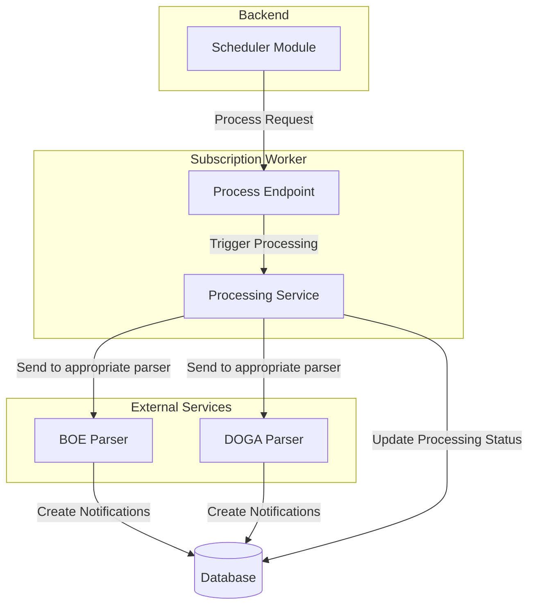

# Subscription Worker Enhancement - MVP Implementation

## Overview

This document outlines the minimal enhancements needed for the Subscription Worker to support the scheduled processing of subscriptions triggered by the Backend Scheduler Module.



## Current Status

The Subscription Worker currently processes subscriptions on-demand, but lacks an endpoint specifically designed for scheduled batch processing. It needs to be enhanced to act as an intermediary that receives processing requests from the Backend Scheduler, forwards them to the appropriate parser, and updates the subscription processing status.

## MVP Requirements

1. Add a dedicated `/process` endpoint to handle requests from the Backend Scheduler
2. Forward subscription processing to the appropriate parser based on subscription type
3. Update subscription processing status in the database (started, completed, error)
4. **Important**: The parsers themselves are responsible for creating notifications in the database

## Implementation

### 1. New Process Endpoint

```javascript
// src/routes/process.js
import express from 'express';
import { processSubscription } from '../services/processor.js';
import logger from '../utils/logger.js';

const router = express.Router();

/**
 * Process a subscription
 * @route POST /process
 * @param {string} subscriptionId - UUID of the subscription to process
 * @param {string} userId - ID of the user who owns the subscription
 */
router.post('/process', async (req, res) => {
  try {
    const { subscriptionId, userId } = req.body;
    
    if (!subscriptionId) {
      return res.status(400).json({ 
        success: false, 
        message: 'Missing required parameter: subscriptionId' 
      });
    }
    
    logger.info(`Processing subscription ${subscriptionId}`, { userId });
    
    const result = await processSubscription(subscriptionId, userId);
    
    return res.json({
      success: true,
      message: 'Subscription processing triggered successfully',
      data: result
    });
  } catch (error) {
    logger.error('Error processing subscription', {
      error: error.message,
      stack: error.stack,
      subscriptionId: req.body.subscriptionId
    });
    
    return res.status(500).json({
      success: false,
      message: 'Failed to process subscription',
      error: error.message
    });
  }
});

export default router;
```

### 2. Processor Service Enhancement

```javascript
// src/services/processor.js
import { getSubscriptionById, updateSubscriptionProcessingStatus } from '../database/subscriptions.js';
import { sendToParser } from './parsers.js';
import logger from '../utils/logger.js';

export async function processSubscription(subscriptionId, userId) {
  try {
    // Update processing status to "processing"
    await updateSubscriptionProcessingStatus(subscriptionId, 'processing');
    
    // Get subscription details
    const subscription = await getSubscriptionById(subscriptionId);
    
    if (!subscription) {
      await updateSubscriptionProcessingStatus(subscriptionId, 'failed', 'Subscription not found');
      throw new Error(`Subscription ${subscriptionId} not found`);
    }
    
    if (!subscription.active) {
      logger.info(`Skipping inactive subscription ${subscriptionId}`);
      await updateSubscriptionProcessingStatus(subscriptionId, 'skipped', 'Subscription is inactive');
      return { 
        success: true, 
        processed: false, 
        reason: 'Subscription is inactive' 
      };
    }
    
    // Send to appropriate parser based on subscription type
    // The parser will handle creating notifications directly
    const result = await sendToParser(subscription);
    
    // Update processing status to "completed"
    await updateSubscriptionProcessingStatus(subscriptionId, 'completed');
    
    logger.info(`Successfully processed subscription ${subscriptionId}`);
    
    return {
      success: true,
      subscriptionId,
      parserResult: result
    };
  } catch (error) {
    // Update processing status to "failed"
    await updateSubscriptionProcessingStatus(subscriptionId, 'failed', error.message);
    
    logger.error(`Error processing subscription ${subscriptionId}`, {
      error: error.message,
      stack: error.stack
    });
    
    throw error;
  }
}
```

### 3. Parser Service Integration

```javascript
// src/services/parsers.js
import axios from 'axios';
import logger from '../utils/logger.js';

const PARSERS = {
  'boe': {
    url: process.env.BOE_PARSER_URL || 'https://boe-parser-415554190254.us-central1.run.app',
    parseEndpoint: '/parse'
  },
  'doga': {
    url: process.env.DOGA_PARSER_URL || 'https://doga-parser-415554190254.us-central1.run.app',
    parseEndpoint: '/parse'
  }
  // Add other parsers as needed
};

export async function sendToParser(subscription) {
  const { id: subscriptionId, type_id: typeId, prompts, user_id: userId } = subscription;
  
  const parserConfig = PARSERS[typeId];
  
  if (!parserConfig) {
    logger.warn(`No parser configuration found for type: ${typeId}`);
    throw new Error(`Unsupported subscription type: ${typeId}`);
  }
  
  try {
    logger.info(`Sending subscription ${subscriptionId} to ${typeId} parser`);
    
    const response = await axios.post(`${parserConfig.url}${parserConfig.parseEndpoint}`, {
      subscriptionId,
      userId,
      prompts: Array.isArray(prompts) ? prompts : JSON.parse(prompts)
    });
    
    logger.info(`Parser ${typeId} successfully processed subscription ${subscriptionId}`);
    
    return response.data;
  } catch (error) {
    logger.error(`Error sending subscription ${subscriptionId} to ${typeId} parser`, {
      error: error.message,
      status: error.response?.status,
      data: error.response?.data
    });
    
    throw new Error(`Parser error: ${error.message}`);
  }
}
```

### 4. Database Functions Enhancement

```javascript
// src/database/subscriptions.js
import { pool } from './connection.js';
import logger from '../utils/logger.js';

export async function getSubscriptionById(subscriptionId) {
  try {
    const query = `
      SELECT 
        s.id,
        s.name,
        s.description,
        s.user_id,
        s.type_id,
        s.prompts,
        s.frequency,
        s.active,
        s.metadata
      FROM subscriptions s
      WHERE s.id = $1
    `;
    
    const result = await pool.query(query, [subscriptionId]);
    
    if (result.rows.length === 0) {
      return null;
    }
    
    return result.rows[0];
  } catch (error) {
    logger.error(`Error getting subscription ${subscriptionId}`, {
      error: error.message,
      stack: error.stack
    });
    
    throw error;
  }
}

export async function updateSubscriptionProcessingStatus(subscriptionId, status, errorMessage = null) {
  try {
    const query = `
      UPDATE subscription_processing
      SET 
        status = $2,
        ${status === 'completed' ? 'last_run_at = NOW(),' : ''}
        ${errorMessage ? 'error = $3,' : ''}
        updated_at = NOW()
      WHERE subscription_id = $1
      RETURNING *
    `;
    
    const params = [subscriptionId, status];
    if (errorMessage) {
      params.push(errorMessage);
    }
    
    const result = await pool.query(query, params);
    
    logger.info(`Updated subscription ${subscriptionId} processing status to ${status}`);
    
    return result.rows[0];
  } catch (error) {
    logger.error(`Error updating subscription processing status for ${subscriptionId}`, {
      error: error.message,
      stack: error.stack
    });
    
    throw error;
  }
}
```

### 5. Server Integration

```javascript
// src/index.js (or app.js)
import express from 'express';
import processRoutes from './routes/process.js';
import subscriptionRoutes from './routes/subscriptions.js';
import healthRoutes from './routes/health.js';
import logger from './utils/logger.js';

const app = express();
app.use(express.json());

// Routes
app.use('/', healthRoutes); // Health check
app.use('/', processRoutes); // New process endpoint
app.use('/', subscriptionRoutes); // Existing routes

// Start server
const PORT = process.env.PORT || 8080;
app.listen(PORT, () => {
  logger.info(`Subscription Worker running on port ${PORT}`);
});
```

## Key Workflow Steps

1. The Backend Scheduler identifies subscriptions due for processing
2. It sends a request to the Subscription Worker's `/process` endpoint
3. The Subscription Worker:
   - Updates the subscription's processing status to "processing"
   - Forwards the subscription to the appropriate parser (BOE/DOGA)
   - The parser processes the content and creates notifications directly in the database
   - Updates the subscription's processing status to "completed" or "failed"

## Testing

To test the implementation:

1. Deploy the enhanced Subscription Worker
2. Test the `/process` endpoint directly:

```bash
curl -X POST https://subscription-worker-415554190254.us-central1.run.app/process \
  -H "Content-Type: application/json" \
  -d '{"subscriptionId": "test-subscription-id", "userId": "test-user-id"}'
```

3. Verify the subscription's processing status is updated in the database
4. Check that the parser was called with the subscription details

## Deployment Steps

1. Update the Subscription Worker codebase with the new endpoint and processing logic
2. Deploy the updated service
3. Update environment variables if needed
4. Test the integration with the Backend Scheduler

## Next Steps After MVP

1. Add support for batched processing of multiple subscriptions
2. Implement more sophisticated error handling and retries
3. Add detailed metrics and monitoring
4. Improve integration with different parser types 